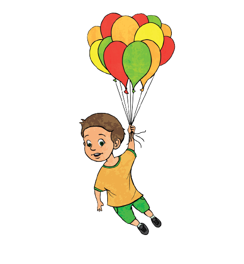

<!DOCTYPE html>
<html lang="en">
<head>
    <meta charset="UTF-8">
    <meta http-equiv="X-UA-Compatible" content="IE=edge">
    <meta name="viewport" content="width=device-width, initial-scale=1.0">
    <title>Document</title>
</head>
<body style="  background-image:url(https://images.unsplash.com/photo-1475274047050-1d0c0975c63e?ixid=MnwxMjA3fDB8MHxzZWFyY2h8Mjl8fG5pZ2h0fGVufDB8fDB8fA%3D%3D&ixlib=rb-1.2.1&w=1000&q=80);">

    

        <article id="lighthouse">
            

              

              

            

            

            

                

                

            

            

          </article>
    

    
    

        
    

    
    

        
            <a style="width: 15pc;position: fixed;top: 4pc;left: 2pc;color: black;font-weight: 700;font-size: 1.6rem;z-index: 1;">
                Perfect Vision Board
            </a>
        
        
        

    

    
    

        
    

    

    
</body>
</html>
